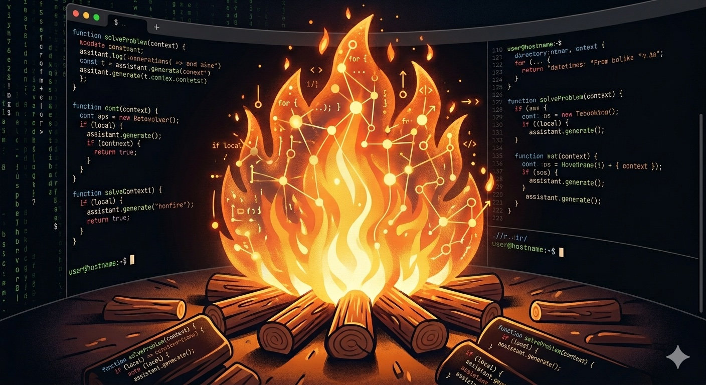

<div align="center">

# bonfire



# Your code. Your model. Your machine.

**A terminal coding assistant that runs against any local model.**

No keys. No meters. No data leaks. Just you and the box you trust.

<!--  -->

</div>

---

## What makes bonfire different

There's no shortage of terminal coding assistants. Here's what bonfire does that the others don't.

### Local-first, by default

The model lives on a machine **you control** — your laptop, your homelab, a friend's GPU rig.  bonfire is just the CLI that talks to it.

- No API keys to leak.
- No tokens to budget.
- No "we may use your data to improve our models."

### Bring your own model

[Ollama](https://ollama.com) on Mac / Linux. [llama.cpp](https://github.com/ggml-org/llama.cpp) when you want serious control. Any OpenAI-compatible endpoint when you're on the road. `qwen3.6:latest`, `llama3.3`, `deepseek-coder-v2` — whatever fits your hardware and your taste.

### Codemap — your repo as a tree of summaries

Other assistants either grep blindly (and choke on a big monorepo) or stand up a vector DB you have to babysit.

bonfire takes a third path: it walks your repo **once**, asks the model for a one-line summary of every file and directory, and stores the result as JSON in `.bonfire/codemap.json`. The model then navigates that tree like a filesystem — reading **summaries**, not source — until it finds what it's looking for.

```
> /codemap
codemap · 247 files · 38 dirs · 285/285 summarized · 142 KB indexed

> where do we handle session deletion?
[bonfire] navigate(".")
  ↳ src/         — TypeScript source for the bonfire CLI
[bonfire] navigate("src")
  ↳ session/     — JSON session persistence in .bonfire/sessions
[bonfire] read_file("src/session/storage.ts")
  ↳ deleteSession(root, id) at line 41

  Sessions are deleted via deleteSession() in src/session/storage.ts:41,
  which unlinks .bonfire/sessions/<id>.json after verifying it exists.
```

**Three tool calls. Zero greps.** Even on a 50K-file repo. The cache invalidates per-file on `mtime` so it stays current as you edit. No embeddings, no vector DB, no daemon, no cloud round-trips.

The first build does read every file — but you only run it once per repo, the result is cached on disk, and `/codemap rebuild` is the only way to redo it.

### Sessions — pick up tomorrow where you left off

Every conversation auto-saves to `.bonfire/sessions/<id>.json` after each turn. List them, share them, diff them, resume them.

```
> /sessions list
Sessions (3):
▸ a3f1c8d92b4e  2 hours ago   12 turns · ollama    · "refactor the auth flow"
  4d8e2f1a7b9c  yesterday     8 turns  · ollama    · "fix the failing test"
  92c1f0e8a4b7  2 days ago    24 turns · llama.cpp · "build codemap navigation"

> /sessions load 4d8e
Loaded session 4d8e2f1a7b9c · 8 messages · cwd: /work/api
```

No SaaS account. No "your history will be cleared in 30 days." Just JSON files on your disk, gitignored by default.

---

## Three ways to run it

bonfire is just a CLI. The model lives wherever you put it. Pick the topology that fits your hardware:

### 1. Self-contained on your laptop

```
[ laptop ]  bonfire  ──  ollama  ──  qwen3.6:latest (local GPU)
```

Works offline. Take it on a plane. Best for M-series Macs, gaming laptops, anything with ≥ 8 GB VRAM.

### 2. Laptop + your homelab

```
[ laptop ]  bonfire  ───→  homelab.local:11434  ──  qwen3.6:latest (24 GB box)
```

Type on the machine you like. Run the **model** on whichever box has the GPU. Set `OLLAMA_BASE_URL=http://homelab.local:11434/api` and you're done.

Best for: Mac mini cluster, the 4090 in the closet, the old gaming PC you stopped using.

### 3. Shared rig with friends

```
laptop A   bonfire ─┐
laptop B   bonfire ─┼──→  llama-server (shared, API-key gated)
laptop C   bonfire ─┘
```

One person hosts a serious model. Everyone else points their bonfire at it. Same shape works for any OpenAI-compatible cloud endpoint when you're traveling.

Best for: small teams, study groups, family GPU.

**Cross-platform.** macOS, Linux, Windows (Terminal / PowerShell). Git Bash / MSYS users prefix with `winpty bonfire`.

---

## Quick start

```bash
npm install -g bonfire
```

Now stand up a model. **Pick the path that fits your platform.**

### macOS / Linux — Ollama is the easy path

Ollama is the most seamless option on Apple silicon and Linux. Single binary, single command:

```bash
ollama pull qwen3.6:latest

cd your-project
bonfire
```

You're done. Skip to [first prompts](#try-these-first).

### Windows — pick by your hardware

**8 – 16 GB RAM → Ollama.** It works on Windows and is easier to set up.

```powershell
ollama pull qwen3.6:latest

cd your-project
bonfire
```

**32 GB+ RAM and you want speed → llama.cpp.** This is the recommended path on Windows for power users. `llama-server` gives you direct control over the quantization, KV cache size, GPU layer offload, and the tool-calling Jinja template — all of which matter when you're feeding a serious model.

```powershell
.\llama-server.exe --jinja -m .\qwen3.6.gguf -c 8192 -ngl 99

cd your-project
bonfire
```

> The `--jinja` flag is **mandatory** for tool calling. Without it, bonfire's tool calls won't reach the model.

### Try these first

- `list the files in src` — feel for navigation
- `/codemap build` — kick off the first summarization pass (slow once; it reads every file)
- `read README.md and summarize what this project does`
- `/help` — every slash command at a glance

---

## Customise it: system prompt + skills

bonfire reads two kinds of markdown from your home directory and your repo, **with no config at all**:

```
~/.bonfire/system.md         # global system prompt (every project)
~/.bonfire/skills/<name>.md  # global skills (every project)
.bonfire/system.md           # project system prompt
.bonfire/skills/<name>.md    # project skills
```

**System prompts** are *appended* to bonfire's built-in prompt. Use them to teach the model about conventions that aren't obvious from the code:

```bash
mkdir -p .bonfire
cat > .bonfire/system.md <<'EOF'
This project uses Bun. Prefer `bun test` over `npm test`.
Treat src/legacy/ as read-only — never edit those files.
EOF
```

Run `/system` inside bonfire to see the assembled prompt.
Set `"systemPromptMode": "replace"` in `bonfire.config.json` if you want to fully replace the built-in.

**Skills** are markdown files the model loads *on demand*. Each has YAML frontmatter and a body:

```markdown
---
name: api-endpoint
description: Add a new HTTP endpoint following project conventions
---

To add a new endpoint:
1. Add the route to `src/server/routes.ts`.
2. Add a handler in `src/handlers/`.
3. Add a contract test in `tests/api/`.
4. Run `bun test` to confirm.
```

At startup bonfire scans both skill directories and tells the model: *"these skills exist, here's their description, call `load_skill(name)` if a request matches."* The body only enters the context when the model asks for it — so you can ship 50 skills without bloating every prompt.

```bash
bonfire /init           # scaffolds .bonfire/system.md + .bonfire/skills/example.md
bonfire /skills         # list available skills
bonfire /skills show api-endpoint   # print a skill's body
bonfire /skills reload  # re-scan after editing
```

---

## Slash commands

| Command | Effect |
| --- | --- |
| `/help` | Show every command (or type `/` for autocomplete) |
| `/init` | Scaffold `.bonfire/system.md` + an example skill |
| `/system` | Show the effective system prompt (base + overrides + skills) |
| `/skills` | List available skills |
| `/skills show <name>` | Print a skill body |
| `/skills reload` | Re-scan skill directories |
| `/codemap` | Codemap stats — files, dirs, summarized count |
| `/codemap build` | Summarize every file (slow once, then cached) |
| `/codemap rebuild` | Wipe cache and re-summarize from scratch |
| `/sessions` | List saved sessions |
| `/sessions new` | Start a fresh conversation |
| `/sessions load <id>` | Resume by hex ID |
| `/sessions save` | Force-save the active session |
| `/sessions delete <id>` | Remove a session |
| `/dirs` | Show the filesystem allowlist |
| `/add-dir <path>` | Grant access to a sibling project |
| `/exit`, `/quit`, `esc` | Leave |

During an approval prompt: `y` = yes, `n` = no, `a` = always (shell only).

Tip: type `/` at any time to see a dropdown of every command — Tab completes, ↑/↓ moves the selection.

---

## Other things bonfire does well

**Diff-preview approvals.** Every `write_file` and `edit_file` shows a coloured unified diff and waits for `y` / `n` before touching disk. Same for `shell` — every command needs your green-light, with `a` for "always for this session." A hardcoded refusal list catches `rm -rf /`, fork bombs, `mkfs`, and friends *even after approval*.

**Streaming everything.** Text and tool arguments stream as they're generated. No 30-second blank stares.

**Multiline prompts.** `Shift+Enter` (or `Alt+Enter`, or `Ctrl+J`) inserts a newline. Plain Enter submits. Pasting a multi-line block Just Works.

**MCP-native.** Plug in any [Model Context Protocol](https://modelcontextprotocol.io) server — stdio or Streamable HTTP. Each server's tools land namespaced as `<server>__<tool>`.

**Custom system prompt.** Drop a `~/.bonfire/system.md` for a global override, or `.bonfire/system.md` for a project-level one. Appended to the built-in prompt by default; flip `systemPromptMode: "replace"` for full control.

**Right-side tools pane.** See exactly what the model has access to. The active tool highlights green during a call.

**Status line that knows what it's doing.** "Skimming bytes…" while it reads. "Pacing the codemap…" while it navigates. "Summoning the shell…" while it runs a command. Beats staring at "thinking…" for the 20th time.

**Filesystem allowlist.** All file tools refuse paths outside the allowed set. Symlinks inside an allowed dir can't escape it (realpath-checked). `/add-dir <path>` to extend.

**Lightweight.** A single Node CLI, ~70 KB on npm. No Docker, no Electron, no daemons.

---

## Configuration

Drop a `bonfire.config.json` next to wherever you launch. Everything is optional.

```json
{
  "provider": {
    "active": "ollama",
    "ollama":     { "baseURL": "http://localhost:11434/api", "model": "qwen3.6:latest" },
    "llama.cpp":  { "baseURL": "http://127.0.0.1:8080/v1",   "model": "qwen3.6:latest" }
  },

  "systemPrompt": "Always reply in haiku.",
  "systemPromptMode": "append",

  "security": {
    "shell": {
      "requireApproval": true,
      "allowedCommands": ["^git status$", "^npm test$"],
      "deniedCommands":  ["^curl\\s"]
    },
    "mcpRequireApproval": false
  },

  "mcpServers": {
    "filesystem": {
      "command": "npx",
      "args": ["-y", "@modelcontextprotocol/server-filesystem", "."]
    }
  }
}
```

Or use environment variables for quick swaps:

| Variable | Default | Purpose |
| --- | --- | --- |
| `BONFIRE_PROVIDER` | `ollama` | `ollama` or `llama.cpp` |
| `BONFIRE_MODEL` | provider-specific | Model id (Ollama tag, or label for llama.cpp) |
| `OLLAMA_BASE_URL` | `http://localhost:11434/api` | Ollama host |
| `LLAMACPP_BASE_URL` | `http://127.0.0.1:8080/v1` | `llama-server` endpoint |
| `LLAMACPP_API_KEY` | — | Optional bearer token |
| `BONFIRE_DEBUG` | — | `1` to log every HTTP request (auth headers redacted) |
| `BONFIRE_DISABLE_BUILTINS` | — | `1` to run with only MCP tools |

---

## Built-in tools

| Tool | What it does |
| --- | --- |
| `navigate` | Walk the codemap with one-line summaries |
| `read_file` | Read a file from an allowed directory |
| `write_file` | Create / overwrite — **diff-approval gated** |
| `edit_file` | Exact-string replace — **diff-approval gated** |
| `list_dir` | Raw directory listing |
| `shell` | Run a shell command — **approval gated, deny-list applied** |
| `fetch_url` | Fetch an http(s) URL — HTML stripped to text, 200 KB cap, 30 s timeout |
| `load_skill` | Load a named skill's full instructions on demand |

---

## MCP servers

bonfire speaks both stdio (local processes) and Streamable HTTP (remote servers, per the [MCP spec](https://modelcontextprotocol.io/specification/2025-03-26/basic/transports#streamable-http)). `${ENV_VAR}` references are expanded at startup.

```json
{
  "mcpServers": {
    "filesystem": {
      "command": "npx",
      "args": ["-y", "@modelcontextprotocol/server-filesystem", "."]
    },
    "github": {
      "command": "npx",
      "args": ["-y", "@modelcontextprotocol/server-github"],
      "env": { "GITHUB_PERSONAL_ACCESS_TOKEN": "${GITHUB_TOKEN}" }
    },
    "remote-docs": {
      "type": "streamable-http",
      "url": "https://mcp.company.com/docs",
      "headers": { "Authorization": "Bearer ${DOCS_MCP_TOKEN}" }
    }
  }
}
```

Tools land namespaced as `<server>__<tool>`. A failing server doesn't block the others. On Windows, bare commands like `npx` / `uvx` are auto-resolved to their `.cmd` shims.

---

## Models that work

Anything trained for tool calling:

| Model | Tool calling | Notes |
| --- | --- | --- |
| `qwen3.6:latest` | yes | **Recommended.** Strong tool calling, good code reasoning. |
| earlier qwen / `qwen3-coder` | yes | Solid fallback if you can't pull 3.6 |
| `llama3.3` / `llama3.1` | yes | Good general coding |
| `hermes3:8b` | yes | Fast, lightweight |
| `llama3-groq-tool-use:8b` | yes | Specifically tuned for tool calling |
| `deepseek-coder-v2` | varies | Check the specific revision |
| `gemma3` / `gemma2` | no | Not tool-tuned |

For llama.cpp, tool calling requires `llama-server --jinja`.

---

## Roadmap

- [x] Codemap navigation
- [x] Session persistence
- [x] Slash-command autocomplete
- [x] Multiline input (Shift+Enter)
- [x] Shell approval + hardcoded deny-list
- [x] Skills support — drop-in `~/.bonfire/skills/<name>.md`
- [x] Configurable system prompt — `~/.bonfire/system.md` + project override
- [ ] Editable diffs (`y` / `n` / `e` opens the patch in `$EDITOR`)
- [ ] Side-by-side model race mode
- [ ] Local RAG tool via a small embedding model
- [ ] First-run benchmark (tokens/sec per installed model)
- [ ] Auto-verify loop — typecheck/test after each edit, feed failures back

---

## Contributing

Issues and small PRs welcome. The codebase is intentionally minimal — favour clarity over cleverness.

```
src/
  config.ts            # bonfire.config.json loader
  agent/
    index.ts           # runAgent, initMcp, listTools
    provider.ts        # lazy provider, debug fetch with header redaction
    stream.ts          # typed normalizer for AI SDK fullStream events
    system-prompt.ts   # 3-layer prompt: built-in + ~/.bonfire + .bonfire/system.md
  tools/
    safe-path.ts       # realpath-aware allowlist (closes symlink escapes)
    approval.ts        # tri-state yes/no/always handler
    shell-policy.ts    # hardcoded deny-list + per-config allow/deny patterns
    file-tools.ts, shell-tool.ts, navigate-tool.ts, fetch-tool.ts
  mcp/
    index.ts, stdio.ts, http.ts, windows.ts
  session/
    index.ts, storage.ts, meta.ts
  skills/
    loader.ts          # scans ~/.bonfire/skills + .bonfire/skills, parses frontmatter
    tool.ts            # load_skill tool — model calls this on demand
  codemap/
    walk.ts, summarize.ts, store.ts, index.ts, ignore.ts, types.ts
  providers/
    index.ts, ollama.ts, llamacpp.ts, types.ts
  cli/
    bin.tsx            # entry: TTY check, MCP boot, render <App/>, signals
    App.tsx            # layout-only composition
    components/        # Header, Transcript, DiffPreview, ApprovalPrompt,
                       # ModifiedFilesPanel, UsageBar, MultilineInput,
                       # CommandSuggestions, ToolsPane, PromptBar
    hooks/             # useAgentStream, useApproval, useProvider, useThinkingPhrase
    commands/          # slash-command registry: codemap, sessions, dirs, help, exit
```

---

## License

MIT
